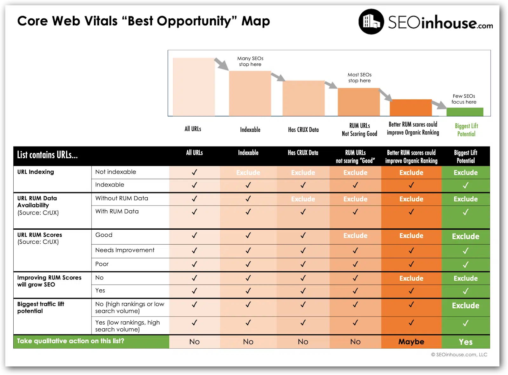

# LHS/CWV Performance Runbooks

A set of runbooks to address web page performance issues and follows [Lighthouse Scoring (LHS)](https://developer.chrome.com/docs/lighthouse/performance/performance-scoring) & [Core Web Vitals (CWV)](https://web.dev/articles/vitals) best practices.

## The key metrics

### Core Web Vitals (CWV)

- [Cumulative Layout Shift (CLS)](./cls.md)
- [Largest Contentful Paint (LCP)](./lcp.md)
- [Interaction to Next Paint (INP)](./inp.md)

### Other Web Vitals

- [First Contentful Paint (FCP)](./fcp.md)
- First Input Delay (FID)
- [Time to First Byte (TTFB)](./ttfb.md)
- [Total Blocking Time (TBT)](./tbt.md)
- Time to Interactive (TTI)
- [Speed Index (SI)](./si.md)

## Related performance topics

- [Marketing Technologies (MarTech)](./martech.md) 3rd-party libraries

## Measuring tools

Follow the steps in the [performance audit](./performance-audit.md) walkthrough, or use one of the tools below.

### Lab

- [PageSpeed](https://pagespeed.web.dev/)
- [Lightouse](https://developer.chrome.com/docs/lighthouse/overview#devtools) in the Chrome DevTools
- [Performance panel](https://developer.chrome.com/docs/devtools/performance/overview) in the Chrome DevTools
- [DebugBear Website Speed Test](https://www.debugbear.com/test/website-speed)
- [webpagetest.org]()

### Field
- [Chrome User Experience (CrUX)](https://developer.chrome.com/docs/crux/dashboard) report
- [Core Web Vitals](https://www.debugbear.com/blog/search-console-core-web-vitals) report in Google Search Console
- [Microsoft Clarity](https://learn.microsoft.com/en-us/clarity/insights/performance-widget)
- [Adobe RUM](https://www.aem.live/docs/rum)

## How to prioritize fixes

1. Is you page indexed in Google Search Console?
    - If not, defer the fix
2. Do you have real user monitoring (RUM) data for that page?
    - If not, defer the fix
3. Are the CWV metrics failing for that page?
    - If not, defer the fix
4. (optional) Is the page ranking low and having high search volume?
    - If not, defer the fix

