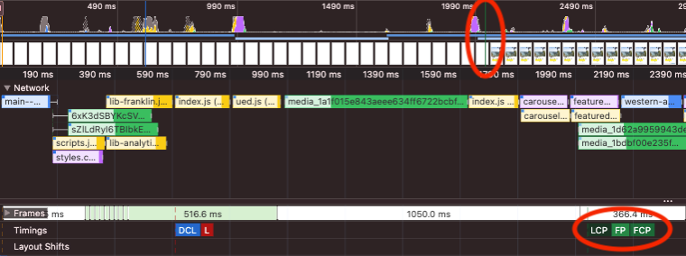
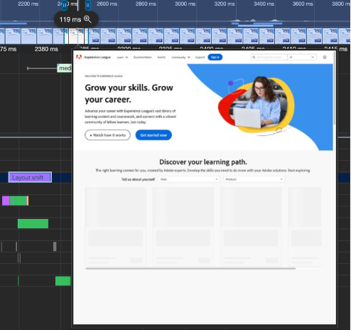

# Chrome Performance Audit

This document is meant as a quick overview of how to leverage the tools built directly into your Chrome browser to debug performance issues and identify opportunities of optimizations in your website code.

 
## The “Performance” Audit

The most common tool to use is the “Performance” audit in the Developer Tools. This will give you a comprehensive overview of how your page loads and highlight the different key events and areas of concern for you.

### How to access the feature?
To access it:
1.	Open your developer tools
2.	Click the “Performance” tab

## Network and CPU throttling
We typically focus on mobile performance for PageSpeed Insights, so in order to obtain similar results, we usually need to “simulate” a slower device by throttling the CPU and network speeds.
1.	Go to the “Performance” tab
2.	Click the cogwheel icon on the right side below the close icon for the Dev Tools
3.	Change the throttling settings in the CPU and Network
We usually stick to 6x CPU and Fast 3G, we are default values that are close enough to what PageSpeed uses in its tests.

## Running an audit
Once you have the audit configured with throttling (if needed), you can go ahead and run it.
1.	Open a new anonymous window (so you avoid performance noise from various extensions, etc.)
2.	Click the round arrow icon on the top left (i.e. Start profiling and reload page)
  
3.	Wait for the profiler to finish capturing the page load

If the profiler finishes before your page if fully loaded, your page likely takes too long to load. You can then instead:
-	manually start a new audit using the record button on the left of the one above
-	manually force reload your page
-	once the page is done loading, click the button again to stop the profiler

After the run is done, you should have something like this:

Here are the relevant bits in a nutshell:

 
## Analyzing the results

### FCP/LCP
Zooming in on the report above, we can see the FCP (_First Contentful Paint_) and LCP (_Largest Contentful Paint_) events in the Timings section, as well as as a green bar in the timeline at the top:

Anything to the left of this should be what is happening in the “eager” phase of the page load, and this is where we’d need to put our focus to improve that particular metric in the PageSpeed report.

Let us look at a different example to see how we’d identify optimization opportunities:

Here we can see that we have a long running request for `/categories` that is render-blocking for the LCP. If we go to the "Network” tab, find the request and check its timings, we see the following:

That particular request is to a reverse-proxi to a different origin than the AEM site, essentially a non AEM service running on the same hostname but different path name. We can see from the details that the TTFB (_time to first byte_) is 1.9s. So the browser is essentially just waiting for that request to complete before it can render the LCp and the rest of the page.
We have several possible approaches to explore:
1.	Can we move up the call to that resource in the page load cycle, possibly downloading it in parallel with the previous set of other JSON requests (the other small gray boxes that precede it)?
2.	Most of the time spent on the request is waiting on the server to respond as can be seen in the Network tab when we select that particular request.
    - Can we speed up that request on the server-side?
    - Can we leverage some caching on the server to speed up follow-up requests?
    - Can we maybe even cache this request directly on the AEM infrastructure?
    - Can we cache it client-side for the duration of the user session?

 
### TBT
_Total Blocking Time_ is triggered when any JavaScript execution time takes longer than 50ms. And any time spent above that threshold is counted toward TBT (i.e. a 51ms task thus accounts for 1ms of TBT).

Zooming in on the initial report above, we can see the TBT as red bars in the timeline at the top, as well as red corners on the bars for the JS executions:

Zooming in even further, we’ll notice that this particular “long task” is spent on doing page layout.

These are usually more complex to tackle, so let us look at a different example to see how we’d identify optimization opportunities:

Most of the TBT that impacts the PageSpeed is usually located before the delayed phase. In the example above, this gives us 3 possible TBTs reported, with the 2nd one being on layout tasks (purple bar), so we’ll ignore it. This leaves us with 2 opportunities, and we’ll focus on the 1st one:

You can click any of the bars to get a reference to the method that it represents and then jump directly to its source. From there you can:
1.	Try to identify if you see repeating patterns of execution that could be simplified or where you could possibly cache the result instead of repeatedly run complex computations
2.	Identify if there is any long method execution at the bottom of the stack which would represent a single “leaf” method that accounts for a long execution and could be potentially optimized
3.	Consider moving that particular CPU intensive task to a worker to offload the main thread

Here is another example:

Here we can see 2 long tasks happening right before the LCP.

Zooming in a bit, we can see that the source of the long JS tasks is gtm.js (Google Tag Manager), which is typically part of the marketing technological stack. These are typically not relevant for the immediate page rendering and can be deferred to after the LCP. So the recommendation here would be to move the gtm instrumentation to the end of the lazy phase or even better in the delayed phase.

### CLS

_Cumulative Layout Shift_ happens when an element is rendered on the page and it forces the next elements to be pushed around to make space for it. This can be for instance an image that is loaded inside a paragraph of text and pushes the text down, or a block/widget that is injected asynchronously inside the page above the content that is currently rendered. Loading of custom fonts also have a tendency to change the text length and paragraph heights and usually lead to CLS if no specific optimization is done.

Here is an example of CLS:

The CLS is shown as vertical purple bars on the Layout Shifts axis. And if you click it, you’ll have some more details in the summary panel at the bottom. Typically, any score >0.01 is something we’d want to look at to reduce the impact on the PageSpeed score.

Clicking the purple bar should also highlight the actual element that was moved around on the page.

Finally, you can also hover the screenshot timeline at the top to visually see what changed before and after the CLS.

 
   
Here we see that we had a lazy-loaded list that returned no results, but the fallback content is taking less vertical space than the loading animation, so the content that follows ends up shifting up. If this had a call-to-action button for instance, we’d risk the button moving under the user’s finger before it was clicked.

Some techniques that can be used to mitigate this:
1.	Reserve the vertical space via CSS so that lazy-loaded elements don’t cause the content below it to be repositioned.
2.	Make sure fallback content uses the same real estate as the expected regular content
3.	If using custom fonts, use proper font-sizing on a fallback font to reserve the space before the new font is applied.
4.	Leave enough free space horizontally so that injected buttons, icons, etc. don’t force text to wrap to the next line

## Resources to dig deeper

-	Chrome DevTools Performance panel
  - https://developer.chrome.com/docs/devtools/performance
  - https://www.debugbear.com/blog/devtools-performance
- [TTFB](./ttfb.md)
- [FCP](./fcp.md)
- [LCP](./lcp.md)
- [TBT](./tbt.md)
- [CLS](./tbt.md)
- https://www.debugbear.com/blog/devtools-performance

